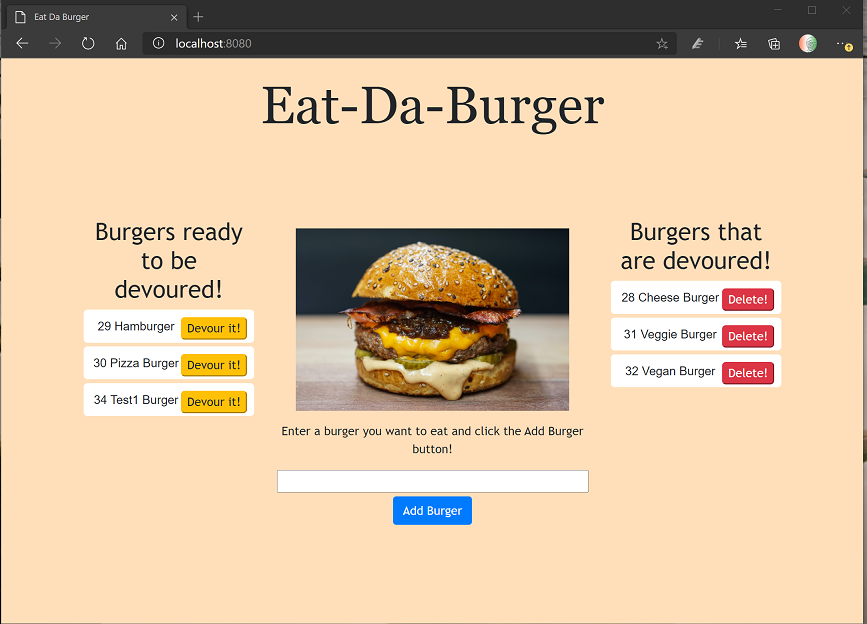

# Burger Logger  (Node Express ORM Handlebars)

## Description
Eat-Da-Burger! (Burger Logger) is a restaurant app that lets users input the names of burgers they'd like to eat.

* Whenever a user submits a burger's name, the app will display the burger on the left side of the page -- waiting to be devoured.

* Each burger in the waiting area also has a `Devour it!` button. When the user clicks it, the burger will move to the right side of the page.

* The app will store every burger in a database, whether devoured or not.
* There is also an option to delete the burger.

Technologies Used: 
* Node.js, Express
* JavaScript, CSS, HTML
* npm
* MySQL database
* ORM
* Handlebars

## Installation

1. To install this code, download the zip file and extract the files to a designated directory on your node.js server without changing the directory/folder structure, or use GitHub's guidelines to clone the repository. 
2. Once the code is extracted, navigate to the project directory and execute 'run npm install' command to install node.js and related dependencies.
3. Use the provided .sql scripts to create required database schema and insert sample records in MySQL database. Note: In case you do not have a running MySQL database, you can download and install the same from [MySQL Community Server](https://dev.mysql.com/downloads/mysql).
4.  Update MySQL connection information in connection.js JavaScript file with correct MySQL database/port/user/password details.

## Usage 
The application can be invoked by using the following command and follow the screen menu prompts after that:

```bash
node server.js
```
## Screenshot of the application:



## Link to functional application deployed on Heroku:

https://burger-loggernk.herokuapp.com/

## Credits

- The application has been developed using JavaScript, Node.js, Express,npm, MySQL, ORM, Handlebars. 

- Sincere thanks to my course instructors Ed (Edward Apostol), Anas (Anas Qazi) and Herman (German Arcila) for teaching and helping me in acquring HTML/CSS/JavaScript/Node.js/MySQL skills. And of course thanks to my fellow students for sharing valuable tips and tricks on Slack study groups.

- Here are some websites that I referred to develop the code:
* https://www.npmjs.com/
* https://www.npmjs.com/package/express
* https://www.w3schools.com/nodejs/
* https://www.npmjs.com/package/uniqid
* https://developer.mozilla.org/en-US/docs/Web/JavaScript
* https://www.w3schools.com/js/default.asp
* https://sqlbolt.com/
* https://dev.mysql.com/
* https://handlebarsjs.com/


## License
Licensed under the [MIT](https://choosealicense.com/licenses/mit/) license.<br>
<br />
## Feedback
Feedback is always appreciated. If you are interested in fixing any issues and contributing directly to the code base, please provide at:
- GutHub Pull Requests: [https://github.com/nagck/burger/pulls](https://github.com/nagck/burger/pulls)
- GitHub: [https://github.com/nagck](https://github.com/nagck)

---